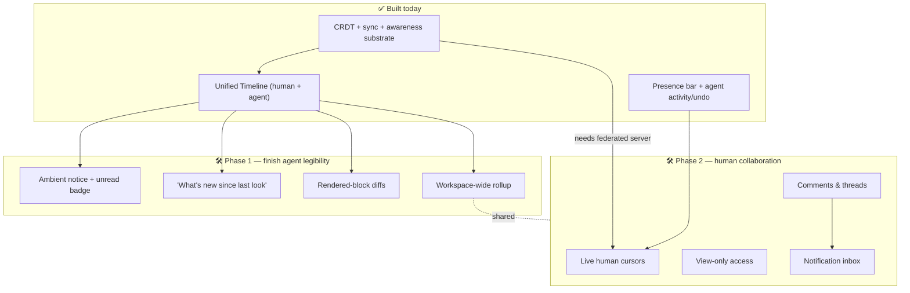

# Collaboration UX: what's built & what's next

**Status:** draft · **Owner:** shagun@inkeep.com · **Hub:** [[README|Collaboration UX]] · **Sources:** [[proposals/0001-collaboration-ux|Proposal 0001]] · [[specs/agent-change-visibility/spec|Phase 1 spec]] · [[specs/human-to-human-collaboration/spec|Phase 2 spec]] · [[guides/collaboration-synthesis|research synthesis]]

A one-page read of where the collaboration experience actually stands. The top half is what already works in the product today; the bottom half is what's left, each with a short, plain explanation of how we'll build it. Everything here is grounded in the `inkeep/open-knowledge` codebase and the two phase specs.

The work is organized around three questions — the [[proposals/0001-collaboration-ux|proposal's]] three pillars:

- **Presence** — *who/what is here?*
- **Change legibility** — *what changed, by whom, and why?*
- **Control** — *can I review, undo, or steer it?*

## ✅ What's been implemented

All grounded in the `inkeep/open-knowledge` codebase. Grouped by pillar; file names are the evidence.

**Substrate (the foundation everything sits on)**

- **Conflict-free real-time sync** — Yjs `Y.Doc`/`Y.Text` CRDT, a Hocuspocus WebSocket server, and editor bindings for both the rich-text and source views (`hocuspocus-plugin.ts`, `TiptapEditor.tsx`, `SourceEditor.tsx`). Two edits to the same doc already merge without conflict.

**Presence — who/what is here**

- **Presence bar with live avatars** for both humans and agents, with "+N" overflow and a "writing" pulse while an agent is mid-edit (`PresenceBar.tsx`, `use-presence.ts`, `agent-presence.ts`).
- **Live cursors + selection are wired** in both editors (`yCursorPlugin` / `yCollab`) — they work across tabs today; what's missing is a shared server so they work between *people* (see Phase 2).
- **One identity model across humans + agents** — a human-vs-agent discriminator, real git names and colors, and the writer-ID taxonomy (`agent-*`, `principal-*`, `file-system`) (`awareness-user.ts`, `identity.ts`).

**Change legibility — what changed, by whom, why**

- **Unified edit-history Timeline** — a reverse-chronological feed of shadow-repo activity spanning agents, humans (via git commits), the file-watcher, and upstream syncs, with per-entry change summaries, expandable diffs, and per-entry restore (`timeline.ts`, `burst-grouping.ts`).
- **Agent write-flash** — changed lines briefly highlight the moment an agent writes, so edits are noticeable in the doc (`agent-flash-source.ts`).
- **Per-agent activity panel** — click an agent to see its burst diffs (`+N −M`) and undo its changes per file (`ActivityPanelBurstRow.tsx`, `ActivityPanelDiffView.tsx`).

**Control — review, undo, steer**

- **Undo / restore** — per-entry restore from the Timeline, plus per-file "undo last / all" for a given agent.
- **Push-permission awareness** — warns when you lack GitHub push rights (`github-permissions.ts`). This is only a git gate, *not* a real in-app viewer/editor role — see Phase 2.

## 🛠️ What we still need to build

Two tracks. **Phase 1** is polish on the agent experience that's already mostly built — small, high-leverage additions. **Phase 2** is the genuinely new surface area: making the product work for *people* collaborating, not just agents. Each item says what it is and, in a sentence or two, how we'll do it.

### Phase 1 — Notification Model

The [[specs/agent-change-visibility/spec|Phase 1 spec]] covers these. The Timeline already does the heavy lifting; these close the gaps around *noticing* and *navigating* changes.

- **An ambient "something changed" signal in the doc.** Today you only see agent activity if you think to open the Timeline tab. *How:* reuse the existing write-flash primitive to briefly highlight edited regions, plus a small unread badge on the Timeline tab — quiet, not a popup.
- **"What's new since I last looked."** A returning user can't tell which entries are new. *How:* store a per-session high-water mark (the last entry you saw) and render everything after it as "new," surfaced as a count plus a filtered view. This is the missing catch-up primitive.
- **Diffs that show the blocks as they look.** Timeline diffs are line-by-line text today; formatting and images don't render. *How:* add a rendered-block diff mode (the changed blocks shown the way they appear in the doc), keeping the line diff as a toggle.
- **Jump from a change to its spot in the doc.** *How:* deep-link each Timeline row to the document position it touched, so one click scrolls you there.
- **A workspace-wide "recent changes" view.** The Timeline is per-document and per-folder only. *How:* roll the same feed up across the whole workspace — one "everything that changed recently" surface.
- **A calm notification model.**Still unsolved; how to announce changes (in-doc flash, badge, toast, OS notification) without multi-agent bursts becoming noise. *How:* coalesce rapid edits into per-agent rollups rather than N separate alerts — signal scales with attention, not edit volume.

### Phase 2 — Human Collaboration

The [[specs/human-to-human-collaboration/spec|Phase 2 spec]] covers these. Most depend on the **federated sync backend** (Miles' track) — real-time human collaboration needs a reachable shared server, and today OK only binds to `localhost`. Comments and permissions can be designed in parallel since they're largely independent of that backend.

- **Live human presence (cursors, selection, follow-mode).** The machinery exists — awareness already carries a `'human'` type and presence renders avatars — but there's no shared server for two people to actually connect to. *How:* once federated sync lands, render live human cursors + selection with identity labels (reusing the same presence plumbing agents use), plus optional follow-a-person viewport sync. *Cursors are for humans; diffs are for agents.*
- **Comments & threads — the big rock.** The single largest gap versus every comparable tool; OK has none today. *How:* the hybrid the whole industry converged on — **anchor in the CRDT, thread body in a side store.** The anchor is a `Y.RelativePosition` (plus a text fingerprint) so it rides concurrent edits and agent rewrites, degrading to "orphaned" rather than pointing at the wrong text; the body, author, replies, resolve state, and mentions live in a lighter side store keyed by thread id. Full reasoning: [[guides/collaboration-synthesis|the comment-anchor decision]].
- **View-only access.** No role model exists — access is just GitHub repo access, not enforced inside OK. *How:* start with a minimal viewer/editor split — the editor renders read-only and every write surface (typing, paste, drag, API) is refused for a viewer. Where roles are enforced (federated store vs git-delegated) is an open question; richer RBAC comes later. How the other tools model this — and what OK should copy — is worked through in [[guides/view-only-access|the view-only access research]].
- **A notification inbox for mentions & replies.** Small but expected once comments exist. *How:* a per-user, persisted inbox that fires when you're @-mentioned or someone replies to your thread — driven off the comment side store. **Prerequisite most miss:** *who you can even @-mention* is unsolved today — identity is per-install (a random per-clone id), not per-person, so a mention can't reliably reach a human across their devices. There's also no directory of *who has access* — today you could only tag people who've already participated. The fix needs an identity model for "a person"; four options (GitHub delegation, a git-email key, a committed members file, or federated accounts) are surveyed in [[guides/collaborator-identity|the collaborator-identity research]].
- **First-class conflict resolution.** Async git-sync conflicts (Layer 2) are tracked in the backend but surface weakly in the UI. *How:* give them a real, distinct resolve screen — visually different from conflict-free live edits, which need no UI at all. This is the *only* place a merge-gate belongs.
- **Route live human edits into the Timeline.** The unified human+agent Timeline already ships — humans appear today via async git commits. *How:* refine, don't rebuild — make *live* human edits flow in as first-class entries and add the cross-workspace rollup (shared with Phase 1).

## How the pieces relate

## Links

- Hub: [[README|Collaboration UX]]
- North star: [[proposals/0001-collaboration-ux|Proposal 0001 — Collaboration UX]]
- Phase 1: [[specs/agent-change-visibility/spec|Agent change visibility]] · [[specs/agent-change-visibility/tasks|tasks]]
- Phase 2: [[specs/human-to-human-collaboration/spec|Human-to-human collaboration]] · [[specs/human-to-human-collaboration/tasks|tasks]]
- Research: [[guides/collaboration-synthesis|UX & data-model synthesis]]

